# Flight Itineraries Data Pipeline — Medallion Architecture on Hadoop, Hive & Airflow

An end-to-end batch ETL pipeline that ingests ~29GB of raw US flight itinerary data, lands it in HDFS, and processes it through a **Bronze → Silver → Gold (medallion) architecture** using **Hive** for transformation and **Apache Airflow** for orchestration — all containerized with **Docker Compose**.

## The 5 V's of Big Data this project addresses

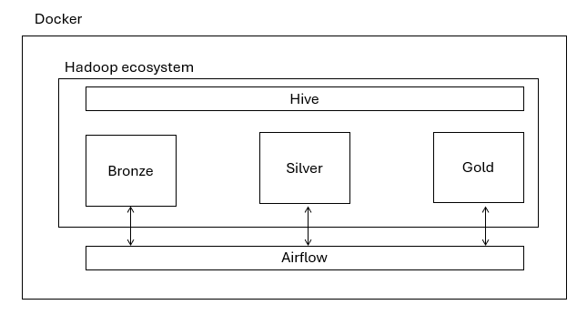

| V | How it shows up here |
|---|---|
| **Volume** | ~29GB / ~5.8M rows of raw itinerary data stored in HDFS |
| **Velocity** | Daily scheduled batch ETL via Airflow |
| **Variety** | Raw CSV → columnar ORC → analytics-ready Parquet |
| **Veracity** | Schema enforcement, type casting, and date parsing in the Silver layer |
| **Value** | Pre-aggregated Gold tables answering concrete business questions (pricing, routes, seasonality) |

## Architecture

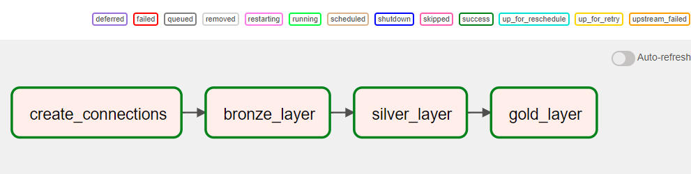

```
CSV (local) → HDFS (WebHDFS) → Hive External Table (Bronze)
                                       ↓
                          Hive ORC Table, typed & cleaned (Silver)
                                       ↓
                     Hive Parquet Tables, business aggregates (Gold)
```

All services run in Docker: Postgres (Airflow + Hive metastore backing store), HDFS NameNode/DataNode, Hive Server2, Hive Metastore, and the Airflow webserver/scheduler.

## Medallion layers

**Bronze** — raw `itineraries.csv` uploaded to HDFS via WebHDFS, exposed as an external Hive table (`bronze_itineraries`), no transformation.

**Silver** — `bronze_itineraries` is cleaned and typed (dates parsed, epoch timestamps converted) and materialized as a Hive table stored in **ORC** format (`silver_itineraries`).

**Gold** — three business-ready aggregate tables stored in **Parquet**, built from the Silver layer:
- `gold_avg_price_by_airline` — average fare and flight count per airline
- `gold_frequent_routes` — top 100 most frequent origin → destination routes
- `gold_price_distribution_by_month` — min/max/avg/median fare per month

## Orchestration (Airflow DAG)

`itineraries_data_analysis_medallion` runs daily and chains:

```
create_connections >> bronze_layer >> silver_layer >> gold_layer
```

- `create_connections` — registers the WebHDFS and HiveServer2 Airflow connections
- `bronze_layer` — uploads the CSV to HDFS and creates the Bronze external table
- `silver_layer` — runs the Hive CTAS query producing the cleaned ORC table
- `gold_layer` — runs the three Hive aggregation queries producing the Parquet Gold tables

Code layout:

```
airflow/dags/itineraries_analysis/
├── main.py              # DAG definition and task wiring
├── config.py            # HDFS/Hive endpoints and table paths
├── tasks.py             # Airflow connection bootstrap
├── utils.py             # Small file/logging helpers
└── modules/
    ├── bronze.py        # Bronze layer: HDFS ingest + external table
    ├── silver.py        # Silver layer: cleaning + ORC CTAS
    └── gold.py          # Gold layer: aggregation + Parquet tables
```

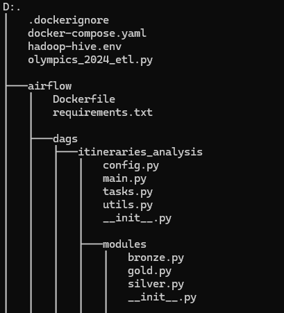

## Tech stack

- **Apache Airflow 2.6.2** — orchestration
- **Hadoop 3.2.1 (HDFS)** — distributed storage
- **Apache Hive 2.3.2** — SQL-on-Hadoop transformation layer
- **PostgreSQL** — Airflow metadata DB and Hive metastore backing store
- **Docker Compose** — service orchestration for the whole stack
- **PyHive / WebHDFS hooks** — Python connectivity from Airflow tasks to Hive/HDFS

## Running it locally

> Requires Docker and Docker Compose. The stack spins up 8 containers (Postgres, NameNode, DataNode, Hive Server2, Hive Metastore, Hive Metastore Postgres, Airflow webserver, Airflow scheduler).

```bash
docker-compose up -d
```

Airflow UI: http://localhost:8080 (user: `admin` / password: `admin`)
HDFS NameNode UI: http://localhost:9870

### Dataset

The full dataset (~29GB, [Expedia flight itineraries](https://www.kaggle.com/datasets/dilwong/flightprices)) is **not included** in this repo. A 1,000-row sample is provided at `airflow/data/itineraries_sample.csv` so the pipeline can be test-run end-to-end. To run against the full dataset, download it from Kaggle and place it at `airflow/data/itineraries.csv`.

## Screenshots

| | |
|---|---|
| **HDFS NameNode overview** 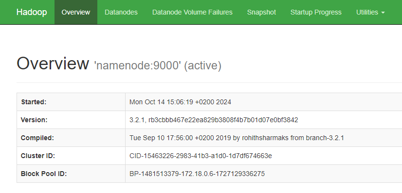 | **HDFS browser — bronze/silver/gold dirs** 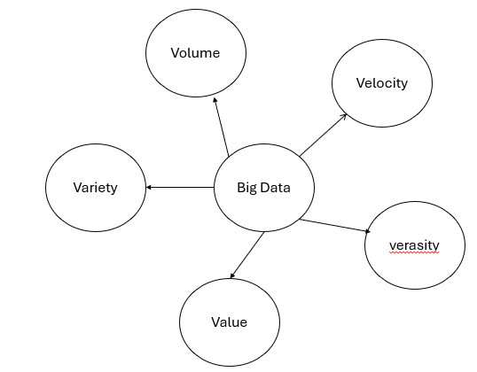 |
| **Datanode usage** 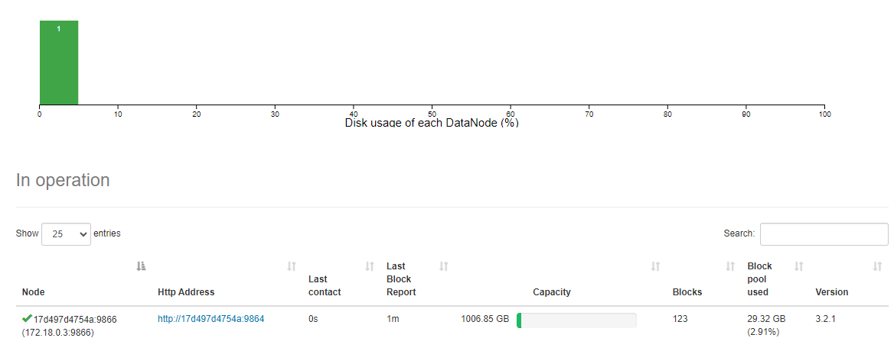 | **Datanode data integration** 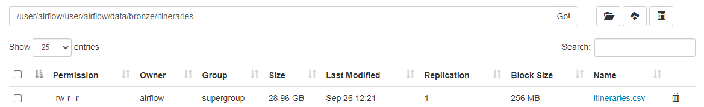 |
| **Docker Compose volumes/networking** 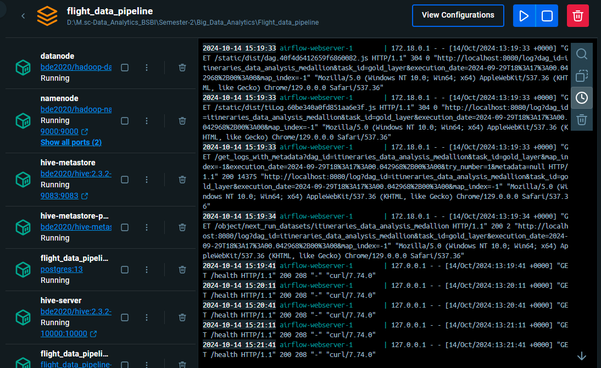 | **Container network** 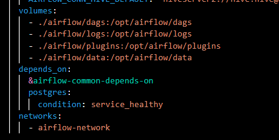 |
| **DAG run history & details** 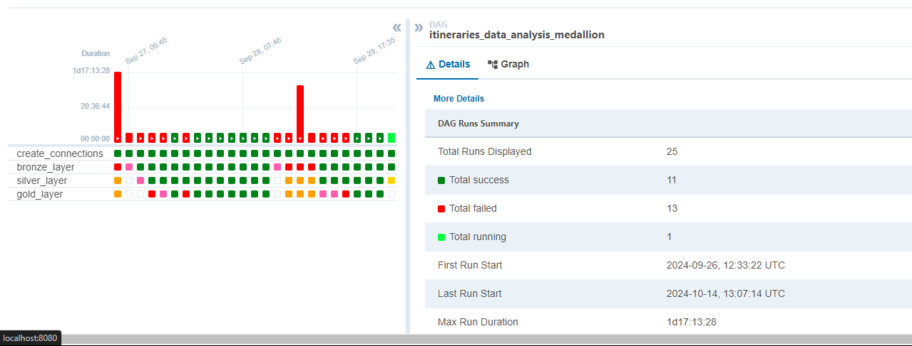 | **ORC (Silver) storage** 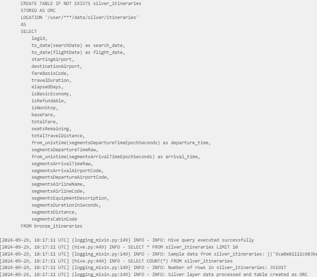 |
| **Parquet (Gold) storage** 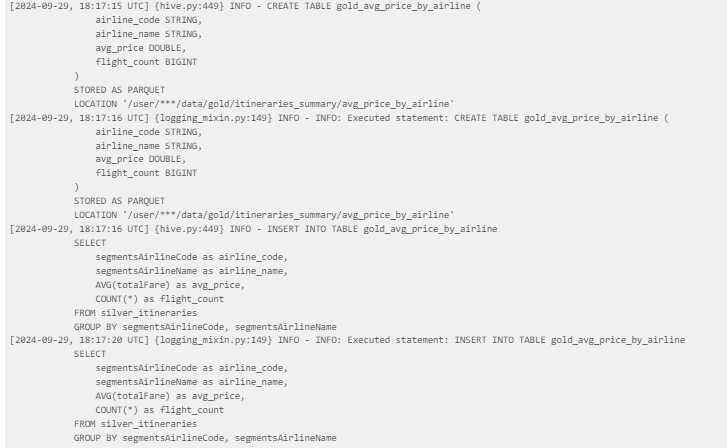 | |

### Gold layer outputs

| | |
|---|---|
| **Average price by airline** 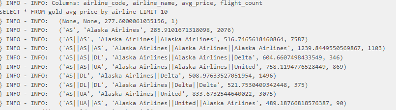 | **Most frequent routes** 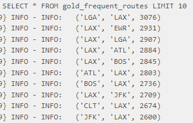 |
| **Price distribution by month** 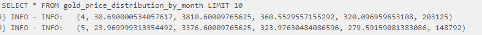 | |

## Notes

This project was built as part of an M.Sc. Data Analytics Big Data Analytics module. The architecture and code were iterated on across several versions (raw Hadoop/Hive scripts → full Airflow orchestration) before arriving at this final pipeline.
